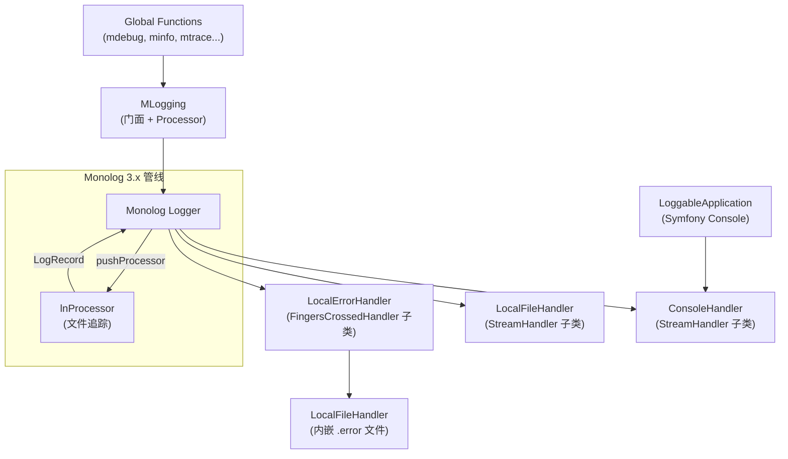

# Design Document

> 本文件为 `.kiro/specs/release-2.0.0/` 的技术设计，描述 Release 2.0.0（PHP 8 Support）的实现方案。

## Overview

本次升级将 `oasis/logging` 从 PHP 5.x/7.x 生态迁移到 PHP 8.2+ 生态。核心变更集中在三个维度：

1. **Monolog 1.x → 3.x**：日志记录从 `array` 变为 readonly `LogRecord` 对象；日志级别从 `int` 常量变为 `Level` enum；handler/processor 方法签名全面更新
2. **PHPUnit 5.x → 11.x**：测试基类、方法签名、XML schema 更新
3. **PHP 8.x 语法兼容**：类型声明、异常层次等适配

设计原则：最小化变更范围，仅修改兼容性要求的部分，不重构架构，不引入新功能。

---

## Architecture

项目架构在升级前后保持不变。以下是组件关系和日志处理管线：



### 升级影响范围

| 组件 | 影响的 Monolog 3.x 变更 | 涉及的 Requirement |
|------|------------------------|-------------------|
| `MLogging::lnProcessor` | `array` → `LogRecord`（readonly，需 `with()`） | Req 2 |
| `MLogging::setMinLogLevel` | `Logger::DEBUG` 等 int 常量 → `Level` enum | Req 6 |
| `MLogging::setMinLogLevelForFileTrace` | `Logger::toMonologLevel()` 返回 `Level` enum | Req 6 |
| `MLogging::log` | `Logger::log()` 的 level 参数适配 | Req 6 |
| `MLogging::getExceptionDebugInfo` | `\Exception` → `\Throwable` | Req 9 |
| `ConsoleHandler::isHandling` | `array` → `LogRecord` | Req 3 |
| `ConsoleHandler::__construct` | bramus formatter 3.x 构造函数变更 | Req 3 |
| `LocalFileHandler::write` | `array` → `LogRecord` | Req 4 |
| `LocalFileHandler::checkFilenameRefresh` | `$this->url` 访问方式 | Req 9 |
| `LocalErrorHandler::__construct` | `ErrorLevelActivationStrategy` 移除 | Req 5 |
| `LoggableApplication::configureIO` | `Logger::WARNING` 等 → `Level` enum | Req 6 |
| `MLogging.inc.php` (全局函数) | level 参数、`\Exception` → `\Throwable` | Req 6, 9 |
| `MLoggingTest` | `PHPUnit_Framework_TestCase` → `TestCase`；`setUp/tearDown` 加 `: void` | Req 8 |
| `phpunit.xml` | schema 更新 | Req 8 |
| `composer.json` | 所有依赖版本约束 | Req 1 |

---

## Components and Interfaces

### 1. `composer.json` — 依赖版本升级 (Req 1)

```json
{
    "require": {
        "php": ">=8.2",
        "monolog/monolog": "^3.0",
        "bramus/monolog-colored-line-formatter": "^3.0",
        "oasis/utils": "^2.0"
    },
    "require-dev": {
        "phpunit/phpunit": "^11.0",
        "symfony/console": "^7.0",
        "symfony/finder": "^7.0"
    },
    "suggest": {
        "symfony/console": "^7.0"
    }
}
```

**决策**：`oasis/utils` 版本约束改为 `^2.0`，假设该包会提供 PHP 8 兼容的 2.x 版本。如果实际发布的兼容版本号不同，需相应调整。

---

### 2. `MLogging::lnProcessor` — LogRecord 适配 (Req 2)

**现状**：接受 `array $record`，直接修改 `$record['channel']`、`$record['message']`、`$record['level']`。

**方案**（CR 决策 Q1 = A）：

- 参数类型从 `array` 改为 `LogRecord`
- 使用 `$record->level` 读取级别（`Level` enum，通过 `->value` 获取 int 值进行比较）
- 使用 `$record->with(channel: ..., message: ...)` 创建新实例返回
- 保持与 1.x 完全一致的输出格式（文件追踪注解直接追加到 message）

```php
public static function lnProcessor(LogRecord $record): LogRecord
{
    $channel = (string) getmypid();
    $message = $record->message;

    if ($record->level->value >= self::$minLevelForFileTrace) {
        // ... 文件追踪逻辑（与现有逻辑相同）...
        // 构建 $suffix = " (filename:line)"
        if (!str_ends_with($message, "\n")) {
            $message .= " ";
        }
        $message .= "(" . basename($last_file) . ":" . $last_line . ")";
    }

    return $record->with(channel: $channel, message: $message);
}
```

**关键变更**：
- `$record['level']` → `$record->level->value`（int 比较）
- `$record['message'] .= ...` → 构建新 message 字符串，通过 `with()` 返回新实例
- `$record['channel'] = getmypid()` → 通过 `with(channel: ...)` 设置
- `StringUtils::stringEndsWith()` → `str_ends_with()`（PHP 8 内置函数，减少对 `oasis/utils` 的依赖）

---

### 3. `ConsoleHandler` — Monolog 3.x + bramus 3.x 兼容 (Req 3)

**3a. `isHandling()` 方法签名**

```php
// 旧：public function isHandling(array $record)
// 新：
public function isHandling(LogRecord $record): bool
{
    if (!CommonUtils::isRunningFromCommandLine()) {
        return false;
    }
    return parent::isHandling($record);
}
```

**3b. 构造函数 — bramus formatter 3.x**

研究结果：bramus 3.x 的 `ColoredLineFormatter` 构造函数签名变更为 6 个参数，第 6 个参数 `$includeStacktraces` 从方法调用变为构造函数参数：

```php
public function __construct(
    ?ColorSchemeInterface $colorScheme = null,
    $format = null,
    $dateFormat = null,
    bool $allowInlineLineBreaks = false,
    bool $ignoreEmptyContextAndExtra = false,
    bool $includeStacktraces = false
)
```

现有代码先构造再调用 `$colored_formatter->includeStacktraces()`。bramus 3.x 仍继承自 `Monolog\Formatter\LineFormatter`，该方法仍然存在，因此现有调用方式仍然兼容。但更简洁的方式是直接在构造函数中传入：

```php
$colored_formatter = new ColoredLineFormatter(
    new DefaultScheme(),
    $output_format,
    $datetime_format,
    true,  // allowInlineLineBreaks
    true,  // ignoreEmptyContextAndExtra
    true   // includeStacktraces
);
// 不再需要单独调用 $colored_formatter->includeStacktraces()
```

**3c. 构造函数 level 参数**

```php
// 旧：public function __construct($level = Logger::DEBUG)
// 新：
public function __construct(Level $level = Level::Debug)
```

---

### 4. `LocalFileHandler` — Monolog 3.x 兼容 (Req 4, Req 9)

**4a. `write()` 方法签名**

```php
// 旧：protected function write(array $record)
// 新：
protected function write(LogRecord $record): void
```

**4b. `checkFilenameRefresh()` 中的 `$this->url` 访问**

研究结果：Monolog 3.x `StreamHandler` 中 `$url` 属性仍为 `protected`（`protected string|null $url = null`），因此子类可以直接访问。**无需变更访问方式**。

**4c. 构造函数 level 参数**

```php
// 旧：public function __construct($path = null, $namePattern = "...", $level = Logger::DEBUG)
// 新：
public function __construct(?string $path = null, string $namePattern = "...", Level $level = Level::Debug)
```

---

### 5. `LocalErrorHandler` — FingersCrossedHandler 适配 (Req 5)

**现状**：使用 `ErrorLevelActivationStrategy` 包装 trigger level。

**方案**（CR 决策 Q3 = A）：Monolog 3.x 的 `FingersCrossedHandler` 构造函数直接接受 `int|string|Level|ActivationStrategyInterface|null` 作为 `$activationStrategy` 参数。当传入非 `ActivationStrategyInterface` 值时，内部自动包装为 `ErrorLevelActivationStrategy`。因此可以直接传入 `Level` enum 值：

```php
// 旧：
// $activationStrategy = new ErrorLevelActivationStrategy($triggerLevel);
// parent::__construct($handler, $activationStrategy, ...);

// 新：
public function __construct(
    ?string $path = null,
    string $namePattern = "%date%/%script%.error",
    Level $level = Level::Debug,
    Level $triggerLevel = Level::Error,
    int $bufferLimit = 1000
)
{
    $handler = new LocalFileHandler($path, $namePattern, $level);
    parent::__construct(
        $handler,
        $triggerLevel,      // 直接传入 Level enum
        $bufferLimit,
        true,               // bubbles
        false               // stopBuffering
    );
}
```

移除 `use Monolog\Handler\FingersCrossed\ErrorLevelActivationStrategy;` import。

---

### 6. `MLogging` — 级别配置与分发 (Req 6, Req 7)

**6a. `setMinLogLevel()` 公共接口**（CR 决策 Q4 = B）

```php
// 旧：public static function setMinLogLevel($level, $namePattern = null)
// 新：
public static function setMinLogLevel(Level $level, ?string $namePattern = null): void
```

内部调用 `$handler->setLevel($level)` 无需转换，因为 `AbstractHandler::setLevel()` 接受 `int|string|Level`。

**6b. `setMinLogLevelForFileTrace()`**

```php
// 旧：
// public static function setMinLogLevelForFileTrace($level)
// {
//     self::$minLevelForFileTrace = Logger::toMonologLevel($level);
// }

// 新：
public static function setMinLogLevelForFileTrace(Level $level): void
{
    self::$minLevelForFileTrace = $level;
}
```

`$minLevelForFileTrace` 属性类型从 `int` 改为 `Level`，默认值从 `Logger::DEBUG` 改为 `Level::Debug`。

**6c. `log()` 方法**

```php
// 旧：public static function log($level, $msg, ...$args)
// 新：
public static function log(string|Level $level, string $msg, mixed ...$args): void
```

`Logger::log()` 在 Monolog 3.x 中接受 `string|Level` 作为 level 参数。全局函数通过 `substr(__FUNCTION__, 1)` 传入字符串（如 `"debug"`、`"info"`），这在 Monolog 3.x 中仍然有效。

**6d. `enableAutoPublishingOnUnexpectedShutdown()`**

```php
// 旧：public static function enableAutoPublishingOnUnexpectedShutdown($publishLevel = Logger::ALERT)
// 新：
public static function enableAutoPublishingOnUnexpectedShutdown(Level $publishLevel = Level::Alert): void
```

**6e. `addHandler()` — handler 注册 (Req 7)**

```php
// 旧：public static function addHandler(HandlerInterface $handler, $name = null)
// 新：
public static function addHandler(HandlerInterface $handler, ?string $name = null): void
```

内部调用的 `pushProcessor`、`setHandlers`、`pushHandler`、`getHandlers` 在 Monolog 3.x Logger 中签名不变（仍接受 `HandlerInterface`），无需修改调用方式。

---

### 7. `LoggableApplication` — Symfony Console 集成 (Req 6)

```php
// 旧：$consoleHandler->setLevel(Logger::WARNING);
// 新：
$consoleHandler->setLevel(Level::Warning);
// 同理：Level::Notice, Level::Info, Level::Debug
```

---

### 8. `MLogging.inc.php` — 全局函数 (Req 6, Req 9)

**8a. `mtrace()` 参数类型**（CR 决策 Q2 = B）

```php
// 旧：function mtrace(\Exception $e, $prompt_string = "", $logLevel = Logger::INFO)
// 新：
function mtrace(\Throwable $e, string $prompt_string = "", string|Level $logLevel = Level::Info): void
```

**8b. `getExceptionDebugInfo()` 参数类型**

```php
// 旧：public static function getExceptionDebugInfo(\Exception $exception)
// 新：
public static function getExceptionDebugInfo(\Throwable $exception): string
```

**8c. 其他全局函数**

`mdebug`、`minfo` 等函数通过 `substr(__FUNCTION__, 1)` 传入字符串 level，Monolog 3.x `Logger::log()` 仍接受字符串，无需修改这些函数的 level 传递方式。

---

### 9. `MLoggingTest` — PHPUnit 11.x 适配 (Req 8)

| 变更项 | 旧 | 新 |
|--------|----|----|
| 基类 | `PHPUnit_Framework_TestCase` | `PHPUnit\Framework\TestCase` |
| `setUp()` 签名 | `protected function setUp()` | `protected function setUp(): void` |
| `tearDown()` 签名 | `protected function tearDown()` | `protected function tearDown(): void` |
| level 常量 | `Logger::DEBUG`, `Logger::INFO`, `Logger::ERROR` | `Level::Debug`, `Level::Info`, `Level::Error` |

**新增测试用例**（CR 决策 Q2 = B）：

- `testThrowableTracing()`：使用 `\TypeError` 验证 `mtrace()` 对 `\Throwable`（非 `\Exception`）的处理

---

### 10. `phpunit.xml` — 配置更新 (Req 8)

```xml
<!-- 旧 -->
<phpunit xsi:noNamespaceSchemaLocation="http://schema.phpunit.de/5.1/phpunit.xsd" ...>

<!-- 新 -->
<phpunit xsi:noNamespaceSchemaLocation="https://schema.phpunit.de/11.0/phpunit.xsd" ...>
```

---

### 11. `lnProcessor` 中的级别比较逻辑

`$minLevelForFileTrace` 改为 `Level` 类型后，比较逻辑变更：

```php
// 旧：if ($record['level'] >= self::$minLevelForFileTrace)
// 新：
if ($record->level->value >= self::$minLevelForFileTrace->value)
```

或使用 `Level::includes()` 方法：

```php
if (self::$minLevelForFileTrace->includes($record->level))
```

选择 `includes()` 方法，语义更清晰。

---

## Data Models

本次升级不涉及持久化数据模型变更。核心数据结构变更仅在运行时：

### LogRecord（Monolog 3.x）

```
LogRecord (readonly class)
├── message: string (readonly)
├── level: Level (readonly, enum)
├── channel: string (readonly)
├── datetime: DateTimeImmutable (readonly)
├── context: array (readonly)
├── extra: array (可写)
└── formatted: mixed (可写)
```

**与旧版 array 结构的对应关系**：

| 旧（array key） | 新（LogRecord 属性） | 备注 |
|-----------------|---------------------|------|
| `$record['message']` | `$record->message` | readonly，需 `with()` 修改 |
| `$record['level']` | `$record->level` | `Level` enum；`->value` 获取 int |
| `$record['level_name']` | `$record->level->getName()` | 通过 enum 方法获取 |
| `$record['channel']` | `$record->channel` | readonly，需 `with()` 修改 |
| `$record['context']` | `$record->context` | readonly |
| `$record['extra']` | `$record->extra` | 可写 |

### Level enum（Monolog 3.x）

| 旧（Logger 常量） | 新（Level enum） | int 值 |
|-------------------|-----------------|--------|
| `Logger::DEBUG` | `Level::Debug` | 100 |
| `Logger::INFO` | `Level::Info` | 200 |
| `Logger::NOTICE` | `Level::Notice` | 250 |
| `Logger::WARNING` | `Level::Warning` | 300 |
| `Logger::ERROR` | `Level::Error` | 400 |
| `Logger::CRITICAL` | `Level::Critical` | 500 |
| `Logger::ALERT` | `Level::Alert` | 550 |
| `Logger::EMERGENCY` | `Level::Emergency` | 600 |


---

## Impact Analysis

### 受影响的文件

| 文件 | 变更类型 | 说明 |
|------|---------|------|
| `composer.json` | 依赖版本约束 | 所有 require / require-dev / suggest 版本号更新 |
| `src/MLogging.php` | 接口签名 + 内部逻辑 | lnProcessor、setMinLogLevel、log 等方法签名和级别类型变更 |
| `src/ConsoleHandler.php` | 接口签名 + 构造函数 | isHandling 签名、构造函数 level 参数、bramus formatter 调用 |
| `src/LocalFileHandler.php` | 接口签名 | write 签名、构造函数 level 参数 |
| `src/LocalErrorHandler.php` | 构造函数 | 移除 ErrorLevelActivationStrategy，直接传入 Level enum |
| `src/LoggableApplication.php` | 常量引用 | Logger::WARNING 等替换为 Level enum |
| `src/MLogging.inc.php` | 参数类型 | mtrace 的 \Exception → \Throwable，level 默认值 |
| `ut/MLoggingTest.php` | 基类 + 签名 + 新增用例 | PHPUnit 11.x 适配 + 7 个新增测试 |
| `phpunit.xml` | schema URL | PHPUnit 11.x schema |

### 行为变化

- **公共接口 breaking change**：`setMinLogLevel()`、`setMinLogLevelForFileTrace()`、`enableAutoPublishingOnUnexpectedShutdown()` 的 level 参数从 `int` 改为 `Level` enum。这是 major version bump（1.x → 2.0.0），breaking change 可接受。
- **mtrace() 参数类型扩展**：从 `\Exception` 扩展到 `\Throwable`，向后兼容（原有 `\Exception` 调用仍有效）。
- **日志输出格式**：保持与 1.x 完全一致，无变化。

### 数据模型变更

不涉及持久化数据模型变更。运行时数据结构变更（`array` → `LogRecord`）仅影响 Monolog 内部管线，不影响日志文件输出格式。

### 外部系统交互

不涉及。本库仅写入本地文件和 stderr，不与外部系统交互。

### 配置项变更

- `composer.json`：所有依赖版本约束更新（详见 Section 1）
- `phpunit.xml`：schema URL 更新（详见 Section 10）
- 无新增或删除的配置项

### State 文档影响

当前 `docs/state/` 目录为空（仅有 README.md），无需更新 state 文档。升级完成后，如需记录系统当前依赖版本，应在 state 中补充。

---

## Error Handling

### 升级过程中的错误处理变更

本次升级不改变错误处理策略。以下是需要确认兼容性的错误处理点：

| 错误处理点 | 现有行为 | 升级影响 |
|-----------|---------|---------|
| `LocalFileHandler::write()` 写入失败 | 捕获 `UnexpectedValueException`，重试一次 | `write()` 签名变更为 `LogRecord`，异常处理逻辑不变 |
| `MLogging::log()` 无 handler | 自动安装 `ConsoleHandler` 或 `LocalFileHandler` | 逻辑不变 |
| `MLoggingHandlerTrait::install()` 类型检查 | 抛出 `LogicException` | 逻辑不变 |
| `enableAutoPublishingOnUnexpectedShutdown` | `register_shutdown_function` 捕获 fatal error | `$publishLevel` 类型从 int 改为 `Level` enum，其余不变 |
| `LocalErrorHandler` 缓冲溢出 | `FingersCrossedHandler` 内部处理 | 由 Monolog 3.x 保证行为一致 |

### `\Exception` → `\Throwable` 的影响

`getExceptionDebugInfo()` 和 `mtrace()` 的参数类型从 `\Exception` 扩展到 `\Throwable`。`\Throwable` 接口定义了 `getMessage()`、`getCode()`、`getFile()`、`getLine()`、`getTraceAsString()` 等方法，与 `\Exception` 完全一致，因此现有的格式化逻辑无需修改。

---

## Testing Strategy

### 测试方法

本次升级采用 **现有集成测试套件 + 新增 example-based 单元测试** 的策略：

1. **现有测试套件迁移**：将 7 个现有测试用例适配到 PHPUnit 11.x，验证升级后行为不变
2. **新增测试用例**：针对 CR 决策 Q2（`\Throwable` 支持）新增测试
3. **全量回归验证**：所有测试在 PHP 8.2+ 环境下通过，零失败、零错误、零弃用警告

### 现有测试用例覆盖矩阵

| 测试方法 | 覆盖的 Requirement |
|---------|-------------------|
| `testLocalFileHandler` | Req 2, 4, 6, 10.3 |
| `testExceptionTracing` | Req 9, 10.4 |
| `testErrorHandlerWithContent` | Req 5, 10.5 |
| `testErrorHandlerWithoutContent` | Req 5, 10.5 |
| `testSetLogLevel` | Req 6, 10.6 |
| `testFileTraceSwitch` | Req 2, 6, 10.7 |
| `testContext` | Req 2 |
| `testAlertOnFatalError` | Req 7, 10 |

### 新增测试用例

现有 7 个测试用例覆盖了核心路径，但升级涉及大量接口签名变更，需要更充分的单元测试来保障原接口尽可能都能继续工作。以下是新增测试用例清单：

| 测试方法 | 目的 | 覆盖的 Requirement |
|---------|------|-------------------|
| `testThrowableTracing` | 验证 `mtrace()` 接受 `\Throwable`（如 `TypeError`）并产生正确输出 | Req 9, 10.4 |
| `testLogWithLevelEnum` | 验证 `MLogging::log()` 接受 `Level` enum 参数正确分发日志 | Req 6 |
| `testSetMinLogLevelWithLevelEnum` | 验证 `setMinLogLevel(Level::Info)` 正确过滤低于该级别的日志 | Req 6 |
| `testSetMinLogLevelForFileTraceWithLevelEnum` | 验证 `setMinLogLevelForFileTrace(Level::Error)` 正确控制文件追踪注解的级别阈值 | Req 6 |
| `testHandlerReinstallation` | 验证同名 handler 重复 `install()` 后日志仍正确输出（覆盖 `setHandlers` 路径） | Req 7 |
| `testConsoleHandlerNotHandlingInNonCli` | 验证 ConsoleHandler 在非 CLI 环境下 `isHandling()` 返回 false（使用 PHPUnit 内置 mock） | Req 3 |
| `testLocalFileHandlerRefreshRate` | 验证 `setRefreshRate()` 后文件名刷新逻辑正常工作 | Req 4 |

**设计原则**：每个公共接口的签名变更（`Level` enum 参数、`\Throwable` 参数）至少有一个专门的测试用例验证。现有测试覆盖的路径不重复测试，新增测试聚焦于升级引入的新参数类型和边界条件。

### 测试适配变更清单

| 变更项 | 说明 |
|--------|------|
| 基类 | `PHPUnit_Framework_TestCase` → `PHPUnit\Framework\TestCase` |
| `setUp()` | 添加 `: void` 返回类型 |
| `tearDown()` | 添加 `: void` 返回类型 |
| Level 常量 | `Logger::DEBUG` → `Level::Debug`，`Logger::INFO` → `Level::Info`，`Logger::ERROR` → `Level::Error` |
| import | 添加 `use Monolog\Level;`，添加 `use PHPUnit\Framework\TestCase;` |

### 验证标准

- `vendor/bin/phpunit` 输出 `OK` 且零失败、零错误
- 无 PHPUnit 框架弃用警告（如 `setUp()` 缺少 `: void`）
- 无 PHP 8.x 弃用警告
- 所有 8 个日志级别函数输出格式与升级前一致

### PBT 不适用说明

本次升级不引入新算法逻辑，仅将现有逻辑从 `array` 操作迁移到 `LogRecord` 对象操作。核心 processor（`lnProcessor`）依赖 `debug_backtrace()` 获取调用栈，无法通过生成随机输入来有效测试。主要风险是类型不匹配，这类问题在首次运行时即暴露。因此采用 example-based 单元测试 + 现有集成测试套件作为验证策略。

---

## Socratic Review

### 审查 log

**Q1: design 是否完整覆盖了 requirements 中的每条需求？**

A1: 是。10 条 requirement 逐一对应：Req 1 → Section 1（composer.json）；Req 2 → Section 2 + 11（lnProcessor + 级别比较）；Req 3 → Section 3（ConsoleHandler）；Req 4 → Section 4（LocalFileHandler）；Req 5 → Section 5（LocalErrorHandler）；Req 6 → Section 6 + 7 + 8（MLogging + LoggableApplication + 全局函数）；Req 7 → Section 6e（addHandler）；Req 8 → Section 9 + 10（测试适配）；Req 9 → Section 4b + 8a + 8b（PHP 8 语法）；Req 10 → Testing Strategy。

**Q2: 技术选型是否合理？是否有更简单的替代方案？**

A2: 本次升级的技术选型空间有限——Monolog 3.x 的 `LogRecord` readonly class 和 `Level` enum 是强制性的 API 变更，没有替代方案。唯一有选择空间的是 CR Q1（`with()` vs extra 字段）和 CR Q3（直接传 level vs ChannelLevelActivationStrategy），用户已在 requirements CR 中做出决策。

**Q3: 接口签名是否足够清晰，能让 task 独立执行？**

A3: 是。每个组件的方案都包含了旧签名 → 新签名的对比、具体代码示例、关键变更点说明。参数类型（`Level` enum、`LogRecord`、`\Throwable`）和返回类型均已明确。

**Q4: 是否有过度设计？**

A4: 无。设计严格遵循"最小化变更范围"原则，仅修改兼容性要求的部分。未引入新抽象、新模式或预留扩展点。`str_ends_with()` 替代 `StringUtils::stringEndsWith()` 是唯一的"顺手优化"，但这是 PHP 8 内置函数，减少外部依赖，合理。

**Q5: Impact Analysis 是否充分？**

A5: 是。公共接口 breaking change（Level enum 参数）已明确标注为 major version bump 可接受。日志输出格式保持不变。无持久化数据模型变更。无外部系统交互变化。配置项变更仅限 composer.json 和 phpunit.xml。

**Q6: requirements Gatekeep Log 中的 4 个 CR 决策是否已体现？**

A6: 是。Q1（LogRecord::with()）→ Section 2；Q2（\Throwable 测试）→ Section 9 + Testing Strategy；Q3（直接传 trigger level）→ Section 5；Q4（Level enum 公共接口）→ Section 6a。

---

## Performance Considerations

### `LogRecord::with()` 对象创建开销

**问题**：旧版 `lnProcessor` 直接修改 `$record['channel']` 和 `$record['message']`（原地修改数组），而新版必须通过 `LogRecord::with()` 创建新的 `LogRecord` 实例。每次日志调用都会经过 processor，这意味着每条日志都会额外创建一个 `LogRecord` 对象。

**分析**：

1. **`LogRecord::with()` 的实际开销**：`LogRecord` 是一个 readonly class，`with()` 方法内部通过 `new self(...)` 创建新实例，传入修改后的属性和原有属性。这是一次浅拷贝——`context`、`extra` 等数组属性是引用传递（PHP 的 copy-on-write 语义），`DateTimeImmutable` 也是引用传递。实际开销仅为一次对象分配 + 属性赋值，不涉及深拷贝。

2. **与旧版的对比**：
   - 旧版：修改 array 的两个 key（`$record['channel'] = ...`、`$record['message'] .= ...`），PHP 内部可能触发 array copy-on-write
   - 新版：创建一个新 `LogRecord` 对象（约 7 个属性的浅拷贝）
   - 差异：新版多一次对象分配，但省去了 array hash table 的 key lookup 和潜在的 copy-on-write

3. **实际影响评估**：
   - 日志库的性能瓶颈在 I/O（文件写入、stderr 输出），不在 processor 的内存操作
   - `lnProcessor` 中最重的操作是 `debug_backtrace(DEBUG_BACKTRACE_IGNORE_ARGS, 12)`，其开销远大于一次对象创建
   - 在典型使用场景中（每秒数百到数千条日志），`with()` 的额外开销在微秒级，不构成性能问题

4. **其他新增对象创建点**：
   - `Level` enum：PHP 8.1+ 的 enum 是单例，`Level::Debug` 等不会重复创建对象，无额外开销
   - `ConsoleHandler` / `LocalFileHandler` 构造函数中的 `Level` 参数：仅在 handler 初始化时使用一次，不影响运行时性能

**结论**：`LogRecord::with()` 的开销可忽略不计，不需要额外的性能优化措施。这是 Monolog 3.x 的标准模式，整个 Monolog 生态（包括所有内置 processor）都采用相同方式。如果未来出现极端高吞吐场景的性能问题，瓶颈也不会在此处。

---

## Gatekeep Log

**校验时间**: 2025-07-15
**校验结果**: ⚠️ 已修正后通过

### 修正项

- [结构] 补充了 `## Impact Analysis` section，覆盖受影响文件、行为变化、数据模型变更、外部系统交互、配置项变更、state 文档影响六个维度
- [结构] 补充了 `## Socratic Review` section，覆盖 requirements 覆盖度、技术选型合理性、接口清晰度、过度设计检查、Impact 充分性、CR 决策体现六个方面
- [结构] 移除独立的 `## Correctness Properties` section，将 PBT 不适用说明合并到 `## Testing Strategy` 的 `### PBT 不适用说明` 小节中，避免空壳 section
- [内容] 现有测试覆盖矩阵中 `testAlertOnFatalError` 补充关联 Req 10（全量测试通过验证）

### 合规检查

**机械扫描**
- [x] 无 TBD / TODO / 待定 / 占位符
- [x] 无空 section 或不完整的列表
- [x] 内部引用一致（Req 1–10 编号与 requirements.md 一致）
- [x] 代码块语法正确（语言标注、闭合）
- [x] 无 markdown 格式错误

**结构校验**
- [x] 一级标题存在且说明文件定位
- [x] 技术方案主体存在（Overview + Architecture + Components and Interfaces）
- [x] 接口签名有明确定义（每个组件的旧→新签名对比 + 代码示例）
- [x] 数据模型有明确定义（Data Models section：LogRecord 结构、Level enum 映射）
- [x] Impact Analysis 存在且覆盖六个维度
- [x] Socratic Review 存在且覆盖充分
- [x] 各 section 之间使用 `---` 分隔

**Requirements 覆盖校验**
- [x] Req 1（Composer 依赖）→ Section 1
- [x] Req 2（LogRecord 适配）→ Section 2 + 11
- [x] Req 3（ConsoleHandler）→ Section 3
- [x] Req 4（LocalFileHandler）→ Section 4
- [x] Req 5（LocalErrorHandler）→ Section 5
- [x] Req 6（级别配置与分发）→ Section 6 + 7 + 8
- [x] Req 7（Handler 注册）→ Section 6e
- [x] Req 8（PHPUnit 适配）→ Section 9 + 10
- [x] Req 9（PHP 8.x 语法）→ Section 4b + 8a + 8b
- [x] Req 10（全量测试）→ Testing Strategy
- [x] 无遗漏的 requirement
- [x] design 方案未超出 requirements 范围

**Requirements CR 决策体现**
- [x] Q1 (A) LogRecord::with() → Section 2
- [x] Q2 (B) \Throwable 测试 → Section 9 + Testing Strategy
- [x] Q3 (A) 直接传 trigger level → Section 5
- [x] Q4 (B) Level enum 公共接口 → Section 6a

**技术方案质量**
- [x] 技术选型有明确理由（Monolog 3.x 强制性变更，无替代方案）
- [x] 接口签名足够清晰（参数类型、返回类型均已明确）
- [x] 模块间依赖关系清晰（架构图 + 影响范围表）
- [x] 无过度设计
- [x] 与现有架构一致（架构不变，仅适配 API）

**目的性审查**
- [x] Requirements CR 回应：4 个 CR 决策均已体现
- [x] 技术选型明确：无待定或含糊的选型
- [x] 接口定义可执行：每个组件有旧→新签名对比和代码示例
- [x] Requirements 全覆盖：10 条 requirement 逐一对应
- [x] Impact 充分评估：六个维度均已覆盖
- [x] 可 task 化：各组件方案独立，可按组件拆分 task

### Clarification Round

**状态**: 已回答

**Q1:** design 中各组件的变更相互独立性较高（composer.json、各 handler、MLogging 核心、测试适配），拆分 task 时是否按组件逐个拆分（每个源文件一个 task），还是按功能切片拆分（如"所有 Level enum 替换"作为一个 task、"所有 LogRecord 适配"作为一个 task）？
- A) 按组件拆分：每个源文件（或紧密相关的文件组）一个 task，如 `composer.json` 一个 task、`MLogging.php + MLogging.inc.php` 一个 task、`ConsoleHandler` 一个 task 等
- B) 按功能切片拆分：将跨文件的同类变更合并为一个 task，如"Level enum 全量替换"一个 task、"LogRecord 适配"一个 task
- C) 混合方式：核心变更按组件拆分，测试适配和配置更新合并为一个 task
- D) 其他（请说明）

**A:** A — 按组件拆分

**Q2:** `composer.json` 的依赖更新（Req 1）是否应作为第一个 task 独立执行并先运行 `composer update` 验证依赖解析，还是与代码变更 task 并行，最后统一验证？
- A) 先行执行：composer.json 更新 + `composer update` 作为第一个 task，确保依赖可解析后再开始代码变更
- B) 并行执行：composer.json 更新与代码变更同步进行，最后统一 `composer update` + 测试
- C) 其他（请说明）

**A:** A — 先行执行

**Q3:** 新增的 7 个测试用例中，`testConsoleHandlerNotHandlingInNonCli` 需要 mock `CommonUtils::isRunningFromCommandLine()`。当前项目未使用任何 mock 框架（现有测试全部是集成测试风格）。是否引入 PHPUnit 内置的 mock 功能，还是跳过该测试用例（因为 CLI 环境下无法真正测试非 CLI 场景）？
- A) 使用 PHPUnit 内置 mock（`createMock` / `createStub`）来 mock `CommonUtils`
- B) 跳过该测试用例，因为在 CLI 测试环境中无法可靠地模拟非 CLI 场景，且该路径的风险较低
- C) 改为手工测试项，记录在 manual-testing checklist 中
- D) 其他（请说明）

**A:** A — 使用 PHPUnit 内置 mock（`createMock` / `createStub`）来 mock `CommonUtils`

**Q4:** design 中提到 `str_ends_with()` 替代 `StringUtils::stringEndsWith()`（Section 2）。这是唯一一处用 PHP 8 内置函数替代 `oasis/utils` 工具方法的地方。是否应在本次升级中系统性地检查其他 `oasis/utils` 调用点，将可用 PHP 8 内置函数替代的地方一并替换，还是仅替换 design 中已明确的这一处？
- A) 仅替换 design 中已明确的 `str_ends_with()` 这一处，其余保持不变（最小化变更）
- B) 系统性检查所有 `oasis/utils` 调用点，将有 PHP 8 内置替代的地方一并替换
- C) 其他（请说明）

**A:** A — 仅替换这一处
